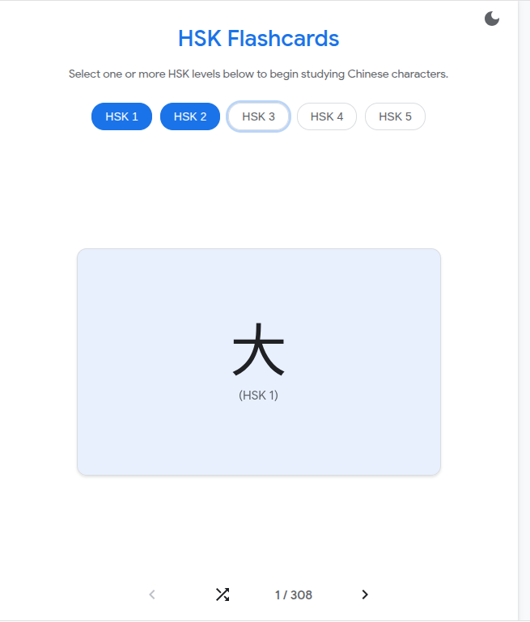

# Run and deploy your AI Studio app

This contains everything you need to run this app locally.

## Run Locally

**Prerequisites:**  Node.js

1. Install dependencies:
   `npm install`
2.  GEMINI_API_KEY` not needed
3. Run the app:
   `npm run dev`
